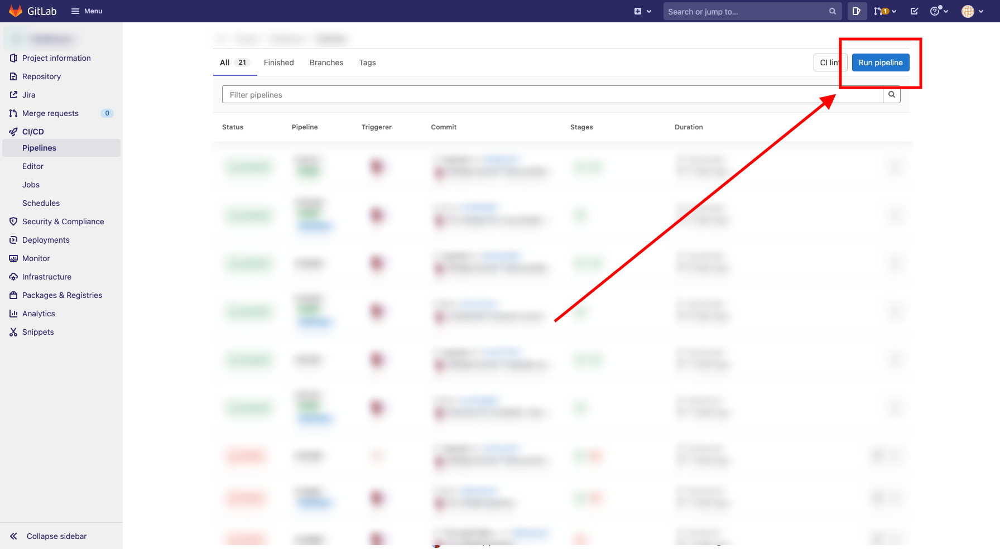
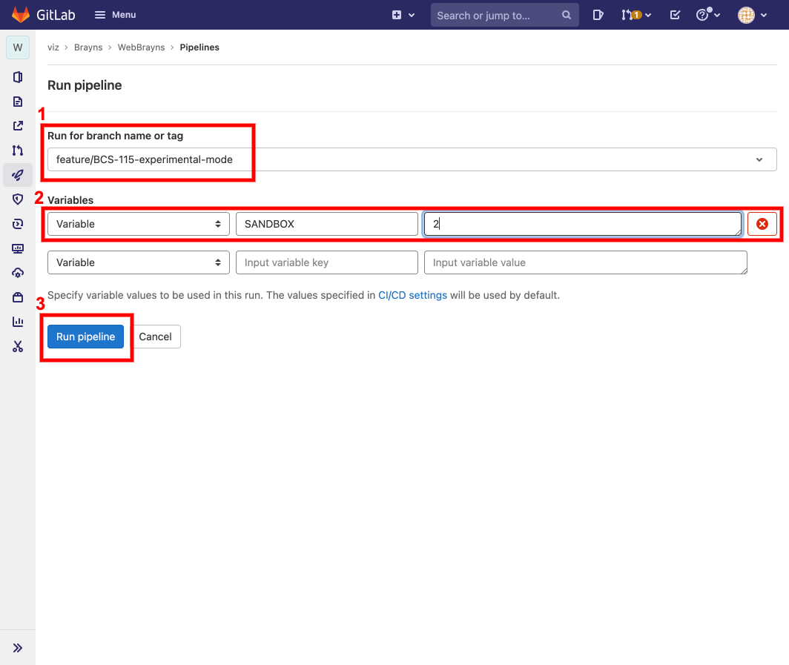

# Brayns Circuit Studio deployment

There are three types of environments that we use in order to run Brayns Circuit Studio:

- production
- staging / development
- sandboxes

For more technical details of the workflows please refer to `.gitlab-ci.yml` file.


## Production

Production is considered the main environment with a stable release that serves to end users. Deployments to this
environment are triggered when a *version tagged commit* is pushed to *master* branch.

The version must be tagged in *1.1* or *1.1.1* format (no prefixes or suffixes since we assume this is a stable
environment).


## Staging

Staging is considered as the *latest* version environment that is being prepared to a final release to a production
environment. It's considered as the last step before (assuming there are no release branches)
the app goes live (production). Staging environment is mainly intended for developers, but it also can be used 
by some users to test out new features.

Staging deployment is triggered once we merge a pull request into `develop` branch.   


## Sandbox

Sandbox is a special group of environments to temporarily test feature or bugfix branches. Developers can control what
branch goes to which sandbox. Deployments to one of sandbox environments are always triggered manually by a developer.

Sandboxes are considered experimental and ephemeral.

### Sandbox deployment

If you want to deploy any branch to one of the sandbox instances, follow these steps:

1. Push your branch to the main repository e.g. `feature/BCS-115-experimental-mode`
2. In Gitlab, go to `Pipelines > Run pipeline` ([https://bbpgitlab.epfl.ch/viz/brayns/braynscircuitstudio/-/pipelines/new](https://bbpgitlab.epfl.ch/viz/brayns/braynscircuitstudio/-/pipelines/new))

3. For **Run for branch name or tag** select your branch (`feature/BCS-115-experimental-mode` in our example).

4. In **Variables** section, set
```
Input variable key = SANDBOX
Input variable value = 2
```
6. Click **Run pipeline**
This will trigger automatic build and deployment of the Docker image.
Once it's done, your instance will be available on [http://s2.braynscircuitstudio.kcp.bbp.epfl.ch/](http://s1.braynscircuitstudio.kcp.bbp.epfl.ch/)


### Sandbox instances

There are 3 sandbox instances. Value of `SANDBOX` variable you provide in Gitlab pipeline
is the target sandbox. Current build of the sandbox will be overridden.
