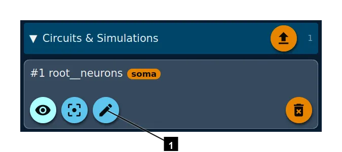
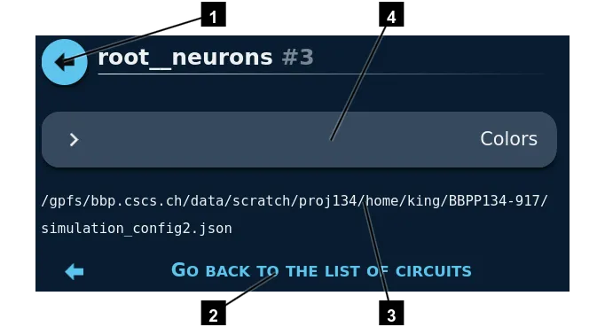
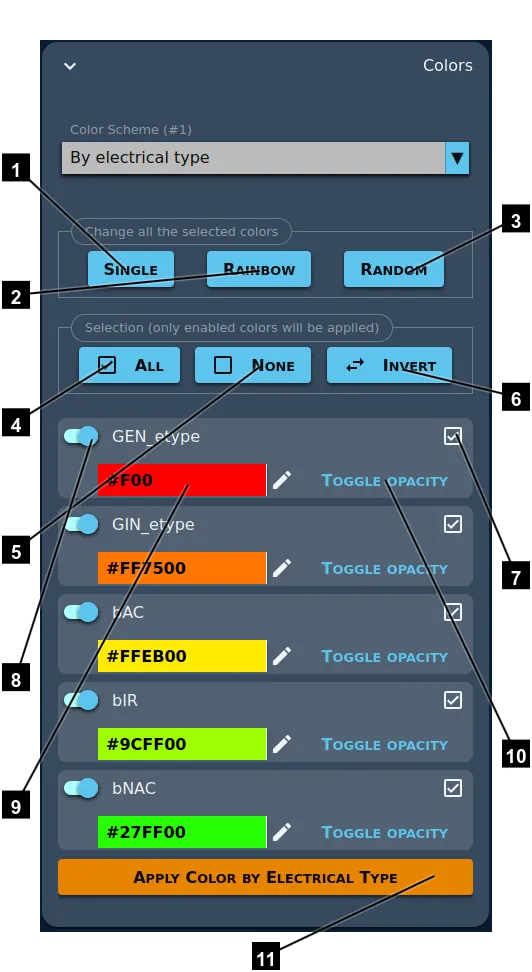

# Changing the colors of a circuit

1. Access the colors panel.

1. Go back to the list of circuits.
2. Go back to the list of circuits.
3. Filename of the circuit.
4. Expand this section to see all the available color methods.

After a little loading time, you get a combo with all the available color methods. This list depends on the circuit.

You will be able to select colors for the simulation, for the e-types, m-types, layers, etc.

Here is an example for the **By electrical type** method:

> Note that only the selected colors will be applied.

1. Set the color of the first one to all the others. In the end, all the colors will be red, in this example.
2. Keep the first color as is, and make a rainbow from it. This way, any two consecutive colors will have a constant hue difference. The colors are rainbowed by default, so this button get you to the default.
3. Set random colors.
4. Select all the colors.
5. Unselect all the colors.
6. Select what is not and unselect what is.
7. Select this color and unselect all the others.
8. Select/unselect this colors.
9. Enter a custom color.
10. There are only two levels of opacity: 0% or 100%. This button switch between these two values. 0% will make the cells invisible. But this can slow the rendering if you have a lot of cells. If you already know that you will need to switch on/off the visibility of a group of cells, the better way it to load the circuit twice, eah time with a different nodeset. Then you can show/hide the while circuit, which is faster than making the cells fully transparent.
11. This will apply only the selected colors.

----

[Back](../welcome)
