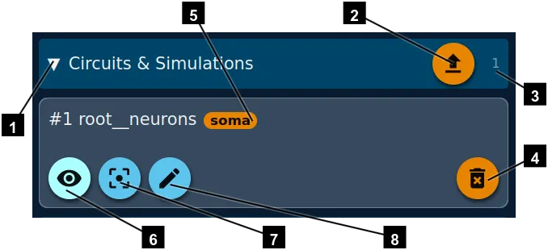
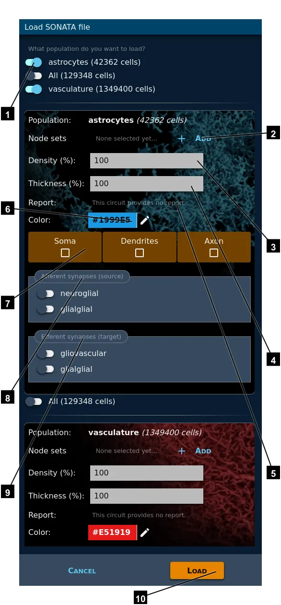

# Load a SONATA file

Circuit studio can load circuits from SONATA files. BlueConfig are deprecated.

1. Reveal/hide the list of currently loaded circuits.
2. Load a SONATA file (see below).
3. Number of currently loaded circuits.
4. Delete this circuit.
5. If a report has been loaded, its name is displayed here.
6. Show/hide the circuit.
7. Reset the camera to look at the whole circuit.
8. Acces th edit panel, where you can [change colors](../colors).

If you click on the upload button (2), you will get a file browser on GPFS. Select the SONATA file (`.json` extension) you want and this screen will appear:

1. If the file has more than one population, you can select the ones you want to load with these switches.
2. Click this button to add a nodeset from the list of available ones.
3. Change the density if you don't want to load all the cells.
4. Change the thickness of the cells. For instance, if you have few cells and you just render them as spheres, it may be usefull to increase the thickness.
5. If the population provides reports, you will get a combo box here to let you select the one you want to load.
6. Initial uniform color for your circuit. You will be able to [adjust colors with more options](../colors) once the file is loaded.
7. By default, each cell is render as a sphere. This is the fastest way to produce an image because it uses less memory and less CPU. But, if you need to see the morphologies of the cell, you can click these selectors.
8. If available, you can also display the **aferent synapses**.
9. Same option for **eferent synapses**.
10. Click here to actually load the circuit. This may take some time for big circuits, especially if you need morphologies.

----

[Back](../welcome)
