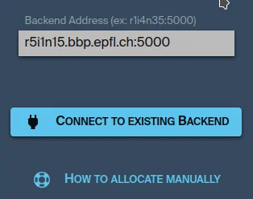

# Manual Allocation

If something goes wrong with UNICORE or if you just need more control on your allocation,
you can do it manually.

First create this `start.sh` file on GPFS:

{{NODE_STARTUP_SCRIPT}}

You can use a command like this one to allocate a node on BB5 and start Brayns:

```bash
ssh bbpv1
srun --account=$ACCOUNT \
     --partition=$PARTITION \
     --time=8:00:00 \
     --qos=longjob \
     -N 1 \
     --exclusive \
     --constraint=cpu \
     --mem 0 \
     --comment=certs \
     ./start.sh
```

You should see this kind of output:

```bash
Brayns Circuit Studio startup script
----------------------
HOSTNAME=r1i6n21.bbp.epfl.ch
```

Just copy the value of **HOSTNAME** in the input box and click **Connect to existing backend**.


