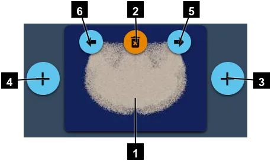

# Movie Maker

Generating a movie can take time. That's why it is not done directly in BCS.
Instead, you will get Python scripts that you will start on BB5.
This way, you will be able to use several nodes to generate the movie faster.

- **Movie duration in sec.**: This is the time the final movie will last when you play it. It's expressed in seconds and ca take a decimal value.
- **Frames per second**: This setting will manage the smoothness of the video. 30 frames per second is enough for most of the scenarios, but if you need something really smooth, you can double it.
- **Resolution**: If you don't want to wait for too much time before checking if the result is what you want, you can set the **Preview** resolution. And if you need a movie for a huge screen, just go for **4K** resolution.

By default, your movie will have the camera that you have now in BCS.
That means that you will get more or less what you are seeing at your screen.

But you may want to make the camera move during the movie.
To do this, you need to add **keyframes**.

Every keyframe you create will remember the current camera position.

1. Preview of what the camera will see at this keyframe.
2. Delete this keyframe.
3. Add a keyframe after this one.
4. Add a keyframe before this one.
5. Set the scene camera to match this keyframe.
6. Update this keyframe with the curren scene's camera.

## Screencasts

### Simulation

<video src="movie-generation.mp4" controls title="Camera moves screencast"></video>

### Camera moves

<video src="screencast-camera-moves.mp4" controls title="Camera moves screencast"></video>
