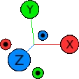

# Scene View

Navigation in the 3D space can be made in three ways:

-   **Orbiting**: camera rotates around a target point.
-   **Translating**: camera moves to its left, right, top or bottom.
-   **Zooming**: camera moves forward or backward.

## Orbiting

The **target** around which the camera will orbit is the center of the active circuit.

-   Move the mouse while holding the left button.

### Orientation widget

Orbiting changes the camera orientation and this is reflected in real time in the
**orientation widget**.
This is a 3D view of the world axis seen from the camera point of view.
There are also 6 tips (colored disks) you can click
to change the camera orientation.

## Translating

-   Move the mouse while holding the right button.
-   Move the mouse while holding the left button and the `Alt` key.

## Zooming

-   Use the mouse wheel.

## Modifiers

You can speed up any gesture by holding **Ctrl Key**.  
You can slow down any gesture by holding **Shift Key**.

---

[Back to main screen](../welcome)
