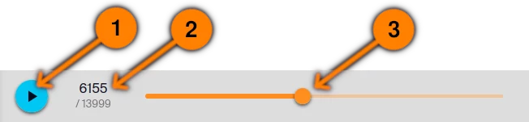

# Simulation bar

## Resting 

1. Start the simulation playback.
2. Current step (_6155_) over the total number of steps (_13999_).
3. Use this slider to navigate the timeline.

## Playing

When the simulation is playing, you cannot use the slider anymore.  
Click on the **pause** button to stop the playback.

----

[Back to main screen](../welcome)