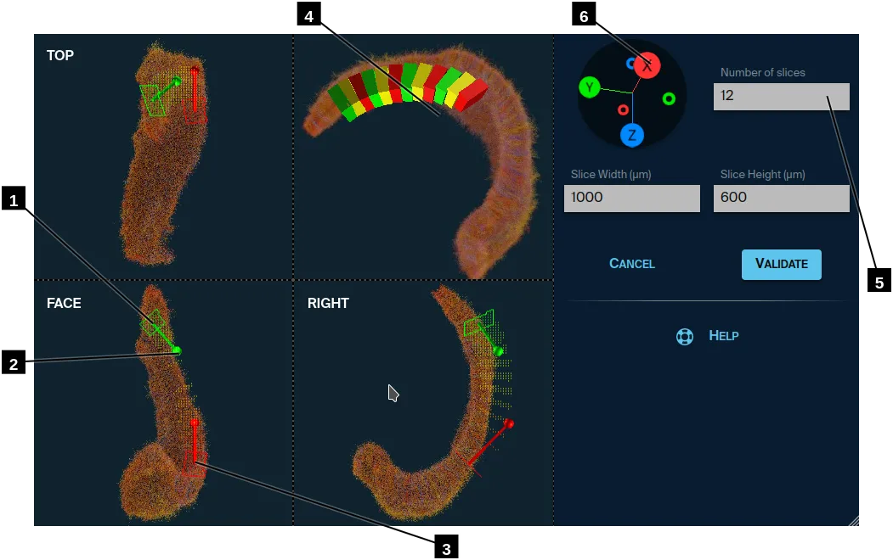

# Creating a slices set with Bezier curves

1. There are three side views: TOP, FACE and RIGHT. The camera orientation is fixed in these views, but you can use the mouse wheel to zoom in/out.
    You can see and manipulate the Bezier curve control points here.
    You can mouve around the slices with your mouse.
2. If you drag the tip of a slice, it will change its orientation.
3. Green is the first slice and red is the last one. You can think of a car that starts when the light is green and stops when its red.  
    This will determine the order in with the slices will be rendered.
4. In this view, you are free to orbit the camera as you want. You can even press and maintain **X**, **Y** or **Z** keys to constraint the rotation around an axis.  
    Mouse wheel will zoom in/out.
5. The more slices you want, the thinner they will be.
6. You can see the orientation in space of the main view.  
    Click on a tip to set the orientation along a given axis.

## Main view

You can see the slices and how they overlap or let gaps.

- Zooming: use mouse wheel (or two fingers slide on MacBook).
- Translating: use right mouse button (or hold Ctrl on MacBook).
- Orbiting: use left mouse button.
  - Hold **X** key to constrain to the X axis.
  - Hold **Y** key to constrain to the Y axis.
  - Hold **Z** key to roll (move mouse right and left).

## Side view

In thoses views, you can move and rotate the slices.
The first slice is green and the last is red.

- Translating: use right mouse button (or hold Ctrl on MacBook).
- Moving a slice: use left mouse near the center of the slice.
- Moving the tip: use left mouse on the tip you want to move.

## Bezier curves

Moving slices gives you the start and end of the curve.
To change the bending, you have to move the tips.

---

[Back](..)
