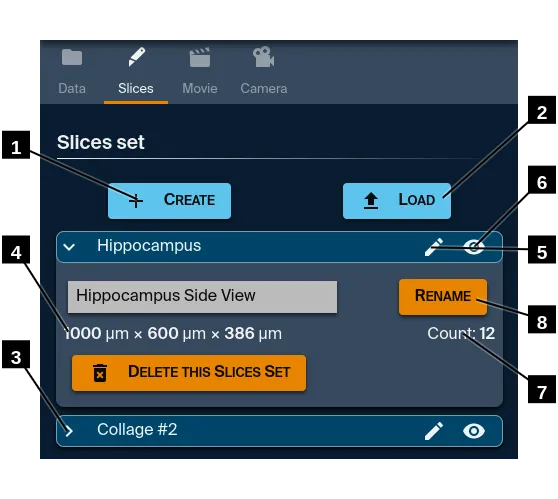

# Slices

All slices of a set have the same dimensions. Only their orientation and center will vary.

1. Create a new **Slices Set** using [Bezier curves](./edit).
2. Load a text file that defines a **Slices Set**.  
    Each line defines a plane with a **center** and a **normal**.
    There are 6 numbers per line: `centerX`, `centerY`, `centerZ`, `normalX`, `normalY` and `normalZ`.
    They are separated by a space, a tabulation, a comma or a semi-colon.
    The thickness of the resulting slices will be computed automatically.
3. Use this chevron to expand/collapse a slices set.
4. Width, height and thickness of every slice in this set.
5. The "pencil" icon brings you to the [Bezier curve editor](./edit).
6. The "eye" icon brings you to the [slices visualization](./view).
7. Number of slices in this set.
8. You can rename a slice set and reuse it on any scene later, because the slices sets are persistent.

---

[Main help page](../welcome)
