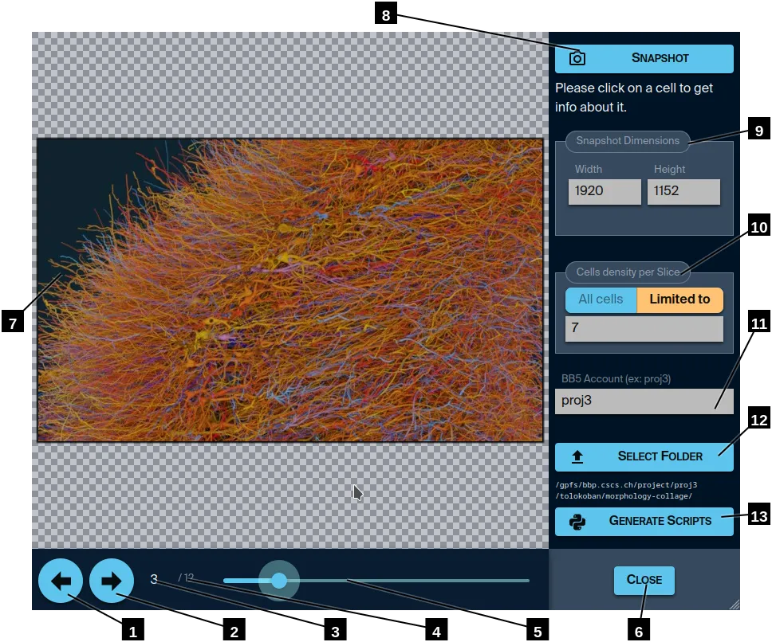

# Slices Navigator

1. Move to previous slice.
2. Move to next slice.
3. Index of the current slice.
4. Max number of slices in this set.
5. Slider to select the slice to view.
6. Go back to Circuit Studio main screen.
7. Static view of the current slice.  
    For performance reasons, in this view, you can see parts of neurons which soma lies outside of the slice.
8. Quick snapshot of the current slice.
9. Dimension of the images rendered by the Python script.  
    The aspect ratio is constraint by the slice actual dimensions.
10. In this preview, you will see all the cells that have been loaded.  
    But you may want to limit the number of cells to a given number.  
    This will be used in the Python script. The cells somas will lie near the central horizontal line and be the most equidistant possible.
11. Since the Python script will need to allocate nodes on BB5, you need to specify the account you want to use.
12. Select the folder where the Python script (and all its dependencies) will be stored.  
    Better use an empty folder for that.
13. Generate the Python script in the selected output folder.

----

[Back](..)
