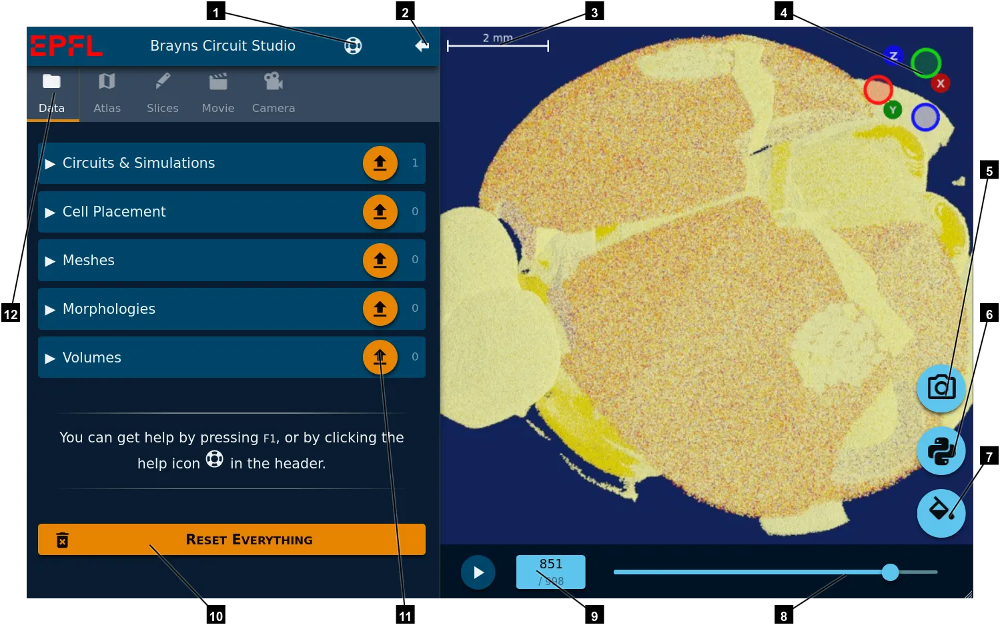

# Circuit Studio

**Circuit Studio** is an application dedicated to circuit/simulation files visualization.  
This software comes with a full documentation: press **`F1`** on your keyboard to bring the contextual help.

> Consult the [how-to](../how-to) section for common usages.

> For questions and bug reports, please fill a [JIRA ticket](https://bbpteam.epfl.ch/project/issues/projects/VIZTM/).

## Main screen

1. **Show help**.
2. **Hide left panel**. Set the scene in fullscreen mode.
3. **Scalebar**. Adpated to the current zoom.
4. **Axis Gizmo**. Shows the XYZ axis. You can change the camera orientation by clicking on any circle. You can use your mouse on the scene to [navigate in space](../scene-view).
5. **Snapshot**. Export still images from the current scene.
6. **Generate Python script**. Create a [Python script](../export-python) to regenerate the current scene.
7. **Background**. Change the background color.
8. **Simulation slider**. Interactive timeline for the current simulation.
9. **Simulation attributes**. Edit the current step and the playback speed.
10. **Reset Everything**. Remove all the circuit/meshes/morphologies/... currently loaded.
11. **Load a file**. Use this buttons to load a specific object: circuit, mesh, morphology, volume, ...
12. **Sections**.
    - **Data**: All the loaded objects, by category.
    - **Altlas**: Hierarchy of all the regions of the mouse brain.
    - **Slices**: Tool to make slices along a path.
    - **Movie**: Export the Python scripts to generate a movie on BB5 using several nodes in parallel.
    - **Camera**: Give information about the camera position.
